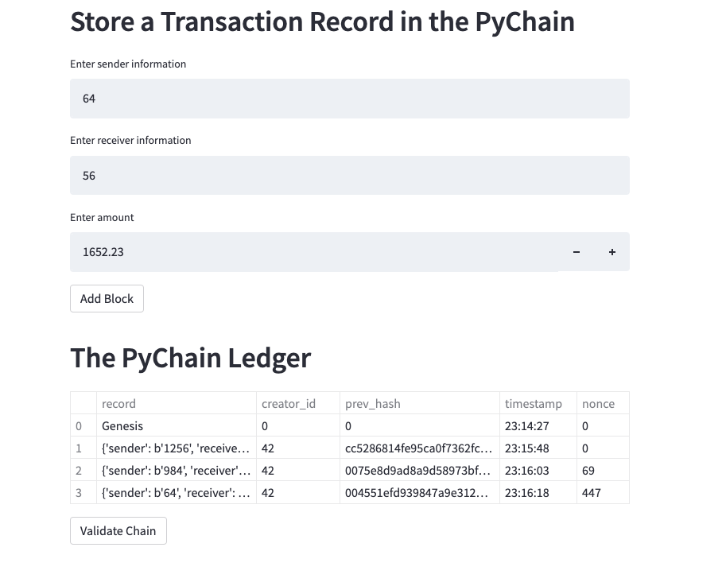
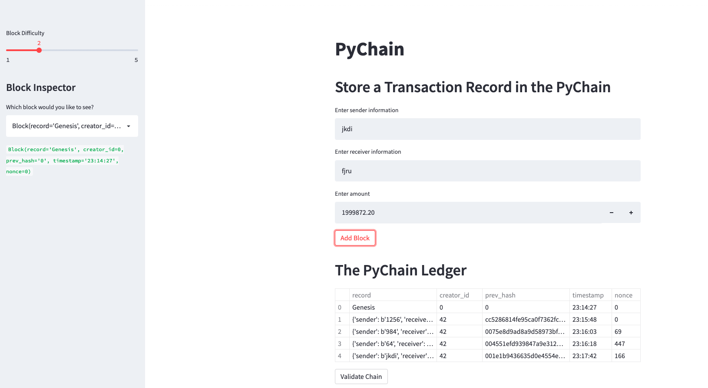
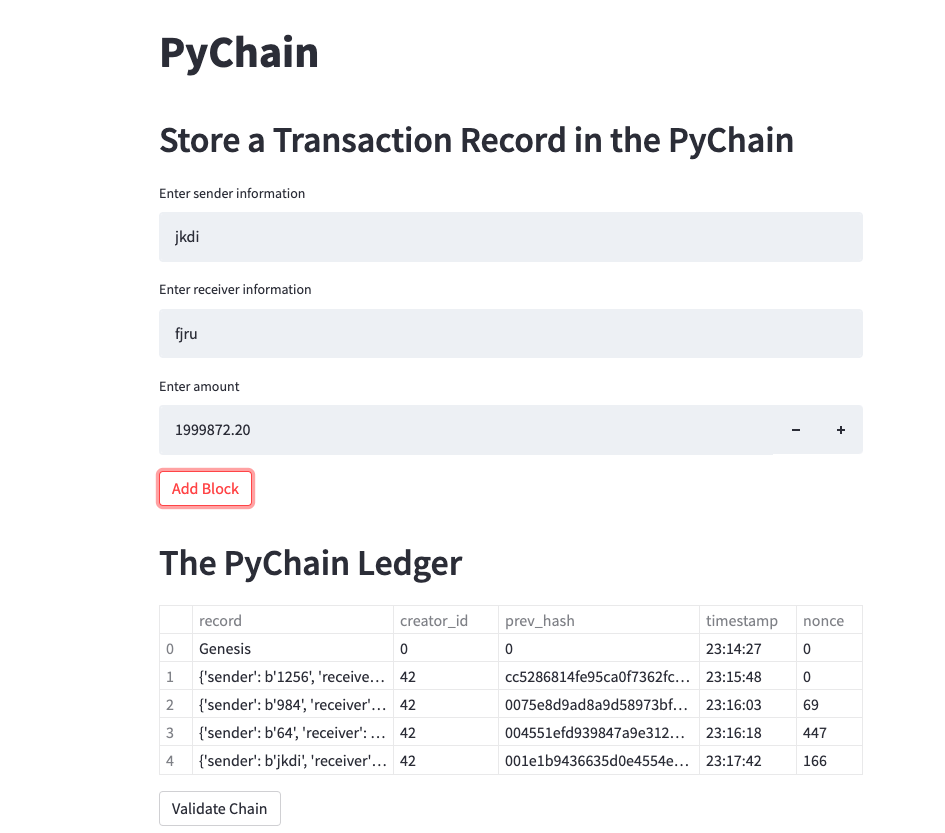

# Module_18

## Blockchain Ledger

I created a blockchain-based ledger system that will allow partner banks to conduct financial transactions between senders and receivers.  This system will allow for transparency and data integrity.

## Usage
For this program i utilized streamlit open source python library for a user interface (with PyChain)

## Visuals

# Technologies 
pip install streamlit==0.84.2 